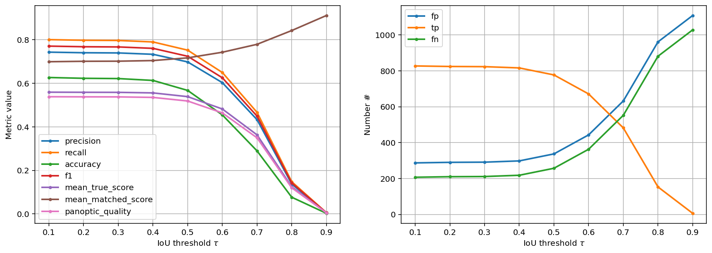
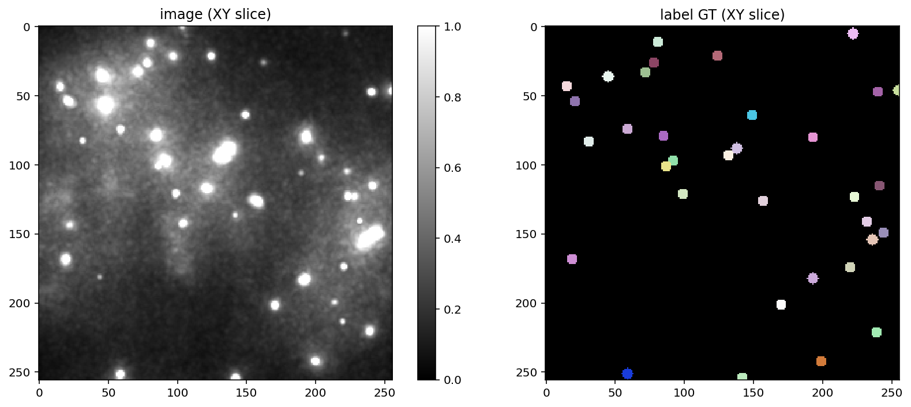
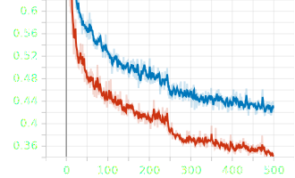

# Abstract
### Ideas, bits and parts

How do you differenciate a cell from a simple circle ? Answering such question sounds trivial at first glance: you can tell visually and from your experience. However, when trying to implement such decision in a computer program the question complexifies. 

With the increasing amount of data generated by biology experiment

Classification and segmentation is a good example for machine learning usezfullness. How do you differenciate a cell from a simple round and how do you scale up your answer without increasing exponentially the time of analysis ?

### Abstract v1
Computer sciences has become a pivotal discipline when approaching biological problems. Indeed, a majority of questions in biology requires the use of big and complex datasets. Hence, the ability to treat these data is crucial. Machine learning provides in that sense a powerfull tool for such problems. Machine learning relies on the principle that a program can "learn" to recognize specific patterns and can thus predict an output from an input. Such tool is extremely useful in image analysis as it enables a large scale and fast analysis. Indeed a major problem in image analysis is segmentation, the ability to distinguish between to separate region. In this report we report a method for quantifying the ability of machine learnng to perform segmentation on images. We discuss different metrics that can be use to supervise such process and we propose a method to compare different network architectures and outputs.

**Key-words:** Machine learning, segmentation, quantification, ...

### Abstract v2

Computer sciences has become a pivotal discipline when approaching biological problems. In microscopy for instance, the instruments and the growing scalability of the experiments has lead the data analysis process to be computer dependent. In the recent years machine learning approaches have been proven to be a powerfull tool for analysis. Machine learning relies on the principle that a program can "learn" to recognize specific patterns and can thus predict an output from an input. A classical problem in image analysis is segmentation, how do you set rules for determining boundaries in data. Fortunatly, such problem is commonly encountered in computer sciences and many techniques have been developped. In this report we report a method for quantifying the ability of machine learnng to perform segmentation on images. We discuss different metrics that can be use to supervise such process and we propose a method to compare different network architectures and outputs.

**Key-words:** Machine learning, segmentation, quantification, ...

### Abstract v3 

#### Evaluating machine learning performance : development of quantification protocol to evaluate AI segmentation algorithms

A.Kanso $*$ , N.Louafi  , M.Nollman**

$*$ Corresponding author: [kanso.ali@outlook.fr](mailto:kanso.ali@outlook.fr) 

** Project Supervisor: [marcelo.nollmann@cbs.cnrs.fr](mailto:marcelo.nollmann@cbs.cnrs.fr) 

Computer science has become a pivotal discipline when approaching biological problems. In microscopy for instance, the instruments and the growing scalability of the experiments have led the data analysis process to be computer dependent. Machine learning, as it has been proven recently to be a powerful tool for analysis, relies on the concept that a program can learn from data, and thus recognize specific patterns and make decisions to predict an output. When talking about image analysis, the fact that we must set rules for determining boundaries in data, makes image segmentation a major problem.Fortunately, such problem is commonly encountered in computer sciences and many techniques have been developed. In this report we introduce a method that quantifies the "accuracy" of machine learning in performing image segmentation and we discuss different metrics that can be used to supervise such process. We also propose a method to compare different network architectures and outputs.

# Introduction
**Topics to introduce**

- How computer sciences help biology
- Introduce the concept of neural networks
- Segmentation 
- How there are no real way of quantifying a network performance
- We used both qualitative (gallery) and quantitative approaches
- Figure that represents the worflow of the method developped
- Why is it important to automatize the segmentation (see Lab1 description)
- What the images will be used for ? 
- Introdue the problematic of we suspect a tendency to miss bright objects 

Figure 1: Principle of neuron network

maybe split this image ? or put it at the end ? 

Replot using an easier image, where you see better the correction ? 

Because we don't really have an experimental part can we directly put a method section and a discussion ? 
# Methods ? 
## Or "key concepts" like J.G.Greener *Nature review molecular cell biology*,2021 

Maybe methods could be something like a lexique ? where we define technical terms used ?:
- Neural network
- Training and validation
- epoch 
- loss function
- segmentation 
- ... 

# Results
### Qualitative approach to network performance
Questions the paragraph is trying to anwser :

Intuitive approach : what does the segmented objects look like ?
Are they all real ? 
Does the network detects background ? if so is it because it is high intensity ?

Responses :

The network seems to segment low intensity objects but also background of high intensity 

### Quantitative approach to network performance

Can we put numbers on qualitative observation we made earlier ? 
Describe each metrics and why do we put it there 

### Further study on intensity sensitivity

Now that we saw that high intensity objects have a tendency to be missed we are going to compare it. 
Introduce astropy, the concept of intensity thresholding why are we using it for the correction 

Apparently we need to make correct it 
### Correcting a network 
Introduce the concept of network training, trainin vs testing dataset , ground truth ?
Introduce the concept of the correction :
- Compare starfind stardist 
- if not the same add a template sphere in the image
- why did we chose this template sphere ?
- cut the image
- relabel the image
- save only the corrected subimages
### Retraining effects
Discuss the improvement of the training if there was 

Probably not all the plots but maybe a combination if the concepts were introduced before ? 

# Discussion 

Figure X:  General workflow of the lab1

- discuss the fact that low intensity object were not corrected for ?
- optimizatyion of the code to work faster 
- optimization of thye code to work on bigger image without surcharging the GPU 
- necessity for such analysis , relevance of needing a corrction for 20% of the opbjects ? 

# References 
**Stardist :**
Schmidt, U., Weigert, M., Broaddus, C., & Myers, G. (2018). Cell Detection with Star-Convex Polygons. In A. F. Frangi, J. A. Schnabel, C. Davatzikos, C. Alberola-López, & G. Fichtinger (Éds.), _Medical Image Computing and Computer Assisted Intervention – MICCAI 2018_ (Vol. 11071, p. 265‑273). Springer International Publishing. [https://doi.org/10.1007/978-3-030-00934-2_30](https://doi.org/10.1007/978-3-030-00934-2_30)

**Machine learning reviews :**

Greener, J. G., Kandathil, S. M., Moffat, L., & Jones, D. T. (2022). A guide to machine learning for biologists. _Nature Reviews Molecular Cell Biology_, _23_(1), 40‑55. [https://doi.org/10.1038/s41580-021-00407-0](https://doi.org/10.1038/s41580-021-00407-0)

Moen, E., Bannon, D., Kudo, T., Graf, W., Covert, M., & Van Valen, D. (2019). Deep learning for cellular image analysis. _Nature Methods_, _16_(12), 1233‑1246. [https://doi.org/10.1038/s41592-019-0403-1](https://doi.org/10.1038/s41592-019-0403-1)

von Chamier, L., Laine, R. F., & Henriques, R. (2019). Artificial intelligence for microscopy : What you should know. _Biochemical Society Transactions_, _47_(4), 1029‑1040. [https://doi.org/10.1042/BST20180391](https://doi.org/10.1042/BST20180391)

**pyHiM:**

Cardozo Gizzi, A. M., Cattoni, D. I., Fiche, J.-B., Espinola, S. M., Gurgo, J., Messina, O., Houbron, C., Ogiyama, Y., Papadopoulos, G. L., Cavalli, G., Lagha, M., & Nollmann, M. (2019). Microscopy-Based Chromosome Conformation Capture Enables Simultaneous Visualization of Genome Organization and Transcription in Intact Organisms. _Molecular Cell_, _74_(1), 212-222.e5. [https://doi.org/10.1016/j.molcel.2019.01.011](https://doi.org/10.1016/j.molcel.2019.01.011)

Espinola, S. M., Götz, M., Bellec, M., Messina, O., Fiche, J.-B., Houbron, C., Dejean, M., Reim, I., Cardozo Gizzi, A. M., Lagha, M., & Nollmann, M. (2021). Cis-regulatory chromatin loops arise before TADs and gene activation, and are independent of cell fate during early Drosophila development. _Nature Genetics_, _53_(4), 477‑486. [https://doi.org/10.1038/s41588-021-00816-z](https://doi.org/10.1038/s41588-021-00816-z)

# Plots

