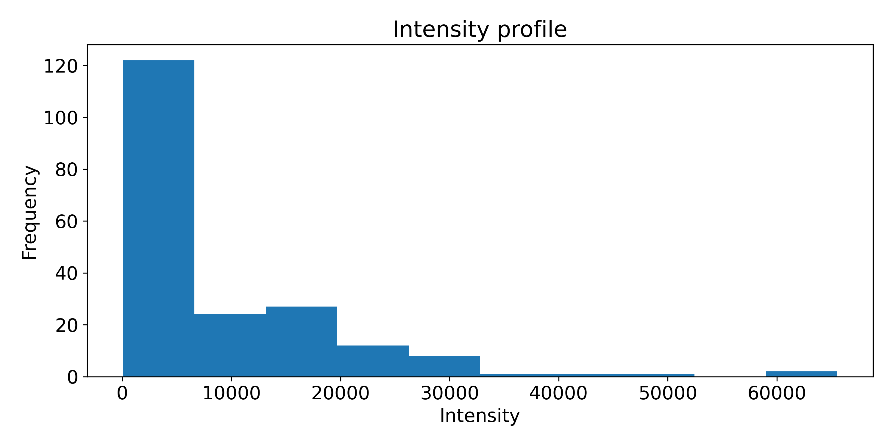
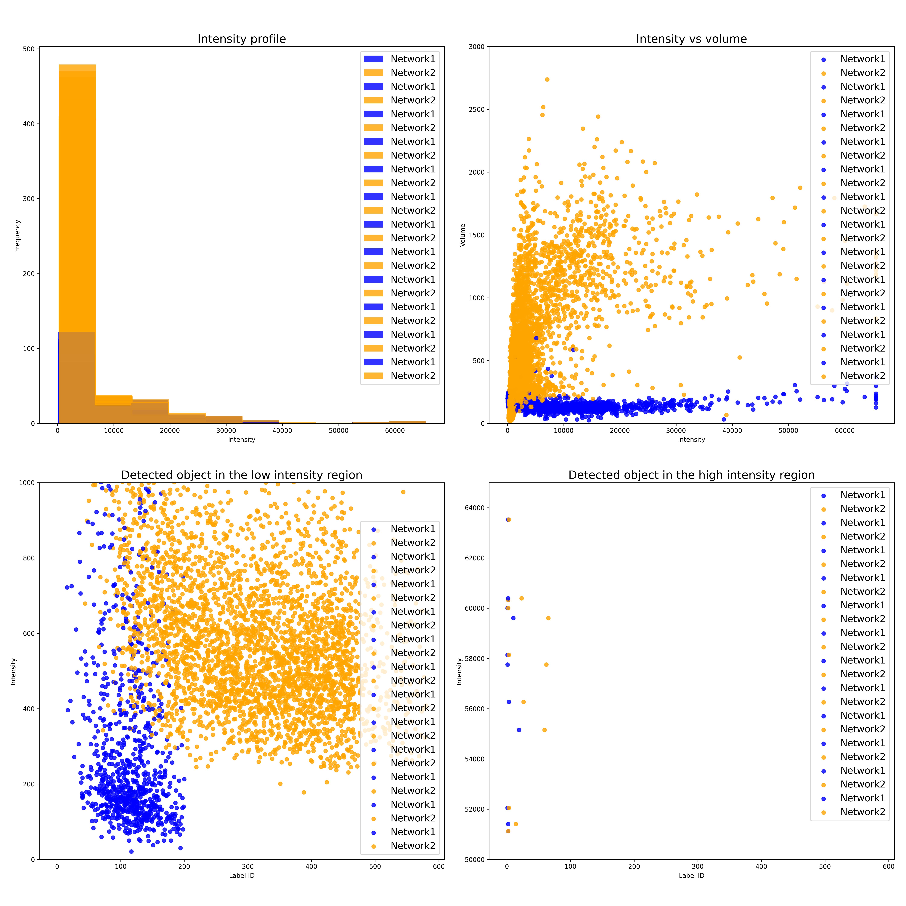
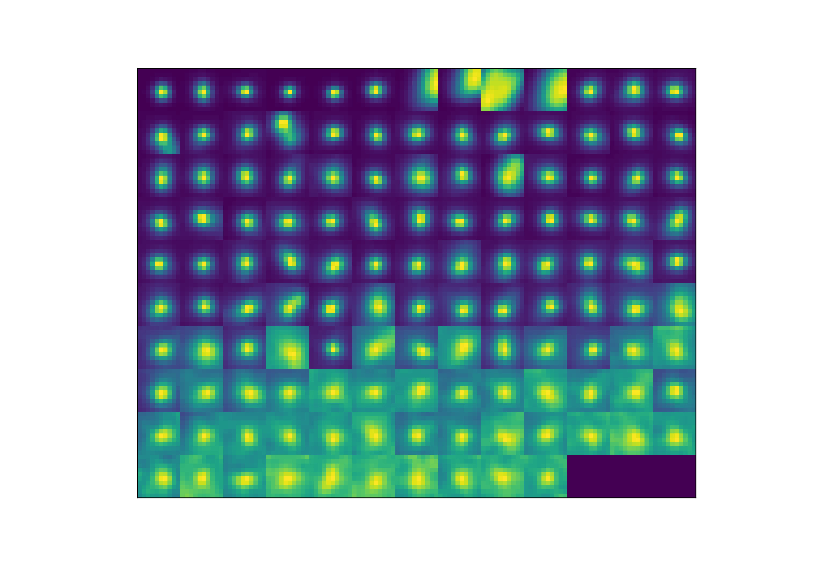

# Thrusday 21/04/2022

## Metrics and performance evaluation

Continuing the idea of the previous week and upon reading in more details the functions of the package scikit image we will use its funtion with 3D images to have better measures of the diferent labels.

The script is present in :

```shell

tronador/jupyter-labs/Lab1/Nessim/krakatoa_run_stardist_performance.ipynb

```

The main idea is to load the images as matrices and then extract certain properties in a table before plotting :

```python

raw= np.load('Outputs/raw/RT11_raw.npy')

print(raw.shape)

lab = np.load('Outputs/labeled/RT11_lab.npy')

print(lab.shape)

properties = ['label', 'area','intensity_max','intensity_mean','centroid_weighted']

region = regionprops_table(lab,intensity_image=raw,properties = properties)

df = pd.DataFrame(region)

```

Iterate for all files use glob :

```python

file_list_r = [x for x in glob('Outputs/raw/'+os.sep+"*.npy") if "00" in x and "ch00" in x]

file_list_l = [x for x in glob('Outputs/labeled/'+os.sep+"*.npy") if "00" in x and "ch00" in x]

```

**Insert plots**

It looks like the first network (*PSF_3D_stardist_20210618_simu_deconvolved_thresh_0_01*) Detects really low intensity objects and doesn't detect certain bright/ big objects next to each other. We will further investiagte that

Once we have a pipleine for one network and because we have 2 different we will perform the same operations and compare the results. Our first hypothesis comes from observation, we saw that for one network the segmented objects were bigger and less round due to the training images. We hope to see that in the area plot. We also want to see wether they both can detect bright objects.

**Insert plot**

To further characterize one network to wether or not it misses bright object or it detects background we will do 2 different approaches :

- Start from the raw image and run starfind to detect the objects and get coordinates. See if those coordinates are also present in the labeled image (would be a measure of how many true points are detected by the network)

- Start from the labeled image and frome those coordinate in the raw image crop the raw image and display a montage of all the segmented points to see wether the network detectyed something real or not. We could also classify them by increasing intensity to make it more pretty

The notebook is :

```shell

tronador/jupyter-labs/Lab1/Nessim/krakatoa_run_stardist_ploting_results.ipynb

```

#### Stardist :

Stardist work by detecting obects that are a certain threshold above in intensity value. It thresholds the image and then pick out the objetcs left. This will allow us to see wether or not networks are able to detect birhgt objects.

Starting from the classic stardist notebook :

```python

mean, median, std = sigma_clipped_stats(data, sigma=3.0)

print((mean, median, std))

daofind = DAOStarFinder(fwhm=3.0, threshold=5.*std)

sources = daofind(data)

for col in sources.colnames:

sources[col].info.format = '%.8g' # for consistent table output

print(sources)

```


What we see is that all the objects detected by starfind are also detected by stardist which is promising for the network. However by also plotting the raw image we see that some objects are not detected by both. We will further try to vary the threshold of starfind to see wether or not everytime stardist find the same objects as starfind.

#### Plotting a gallery of images

The idea here is to extract the coordinate from all the labels (the centroids) and then report those coordinates in the raw image and plot a crop of that location. This will visually tell us which objects are being segmented and by insepection we can say whether or not they are real :

We chose an area of 5 pixel in the 2 direction for the crop to make sure we have all the object

```python

properties = ['label', 'area','centroid']

df = pd.DataFrame(regionprops_table(lab_moy,intensity_image=data,properties = properties))

pos = []

for i in df.index:

pos.append(list(df.iloc[i, 2:]))

crop = []

for j in range(len(pos)):

crop.append(data[round(pos[j][0]-5):round(pos[j][0]+5),round(pos[j][1]-5):round(pos[j][1]+5)])

#plot everything

_, axs = plt.subplots(10, 13, figsize=(30, 30))

axs = axs.flatten()

for img, ax in zip(crop, axs):

ax.imshow(img)

plt.show()

```

Going further and because we have a 3D segmentation we will use the centroid in z to extract the center plane for all objects so we avoid working with projection (will be usefull for later computation):

```python

properties = ['label', 'area','centroid']

df_2 = pd.DataFrame(regionprops_table(lab,intensity_image=raw,properties = properties))

pos_2 = []

for i in df_2.index:

pos_2.append(list(df_2.iloc[i, 2:]))

crop_2 = []

for j in range(len(pos_2)):

crop_2.append(raw[round(pos_2[j][0]),round(pos_2[j][1]-5):round(pos_2[j][1]+5),round(pos_2[j][2]-5):round(pos_2[j][2]+5)])

```

We will now compute the intensity profile of all the cropped images and rank the images by intensity to have a measure of the range of detection.

# Friday 22/04/2022

### Metrics script

Creation of an analysis pipeline for metrics computation and performance evaluation for 2 or more networks. See krakatoa_run_stardist_evaluating_performance.

The first measure we want to look at is the intensity profile of the segmented objects. This will give information about what kind of objects did the network segmented :



Then we can plot some other global metrics :


Notably we can have access to object intensity vs volume and see whether we detected the same objects with a constant volume or not. The other plot are to see whether the networks percieved high intensity value objects and/or low intensity object and have access to their label ID to find them in the segmented image. In the example above we can see that the network "saw" low intensity objects quite well and detected a few high intensity objects. Now we need to see whether or not those objects are "real". Note that the high/low region was determined used the characteristic of the camera and the raw image (here we had 16bit images which thus have a max intensity of 65000 detectable)

Now that wer have metrics we can plot for 2 different networks and see whether or not we can differenciate the 2. We can also iterate over a large number of images to scale the analysis.



note that the legend is wrong

We can clearly see a difference in the network performance from these metrics. First the second networks detected a lot more objects and also bigger objects. What we also see is that the second network did not detec objects that are low intensity. There is a clear cut-off around 250 intensity. This is due to the training of the network which was based on intensity value, thus we find an intensity threshold.

### Gallery collage and ranking by intensity

```python

raw= np.load('Outputs/raw/scan_002_RT17_004_ROI_converted_decon_ch00_raw.npy')

lab = np.load('Outputs/labeled/scan_002_RT17_004_ROI_converted_decon_ch00_mask.npy')

def gallery(lab,raw,r):

properties = ['label', 'centroid_weighted']

df = pd.DataFrame(regionprops_table(lab,intensity_image=raw,properties = properties))

pos = []

for i in df.index:

pos.append(list(df.iloc[i, 1:]))

crop = []

for j in range(len(pos)):

crop.append(raw[round(pos[j][0]),round(pos[j][1]-r):round(pos[j][1]+r),round(pos[j][2]-r):round(pos[j][2]+r)])

matrice = []

for k in range(len(crop[:])):

matrice.append([crop[k],np.max(crop[k])])

matrice_s = sorted(matrice, key=lambda m: m[1],reverse=True)

matrice_f = []

for l in range(len(matrice_s)):

matrice_f.append(matrice_s[l][0])

for o in range(len(matrice_f)):

matrice_f[o].astype('float')

matrice_f[o] = matrice_f[o]/np.max(matrice_f[o])*100

images = [Image.fromarray(x) for x in matrice_f]

new_im = Image.new('I;16', (130,100))

x = 0

y = 0

m = 0

while m<len(images):

for n in range(13):

if m+n<len(images):

new_im.paste(images[m+n], (x+n*10,y))

else: break

y += 10

m += 13

figure(figsize=(10, 7))

plt.imshow(new_im)

plt.xticks([])

plt.yticks([])

#plt.show()

g = gallery(lab,raw,5)

```

This code creates a collage of all the detected objects found by the network transposed to the raw image and ranked by increasing intensity:



What we can see from this images that comes from the network *PSF_3D_stardist_20210618_simu_deconvolved_thresh_0_01* is that the network was able to seghment low intensity objects that are found on the background meaning just above noise.

This function could thus be used as a first analysis when running the segmentation on new images.
 