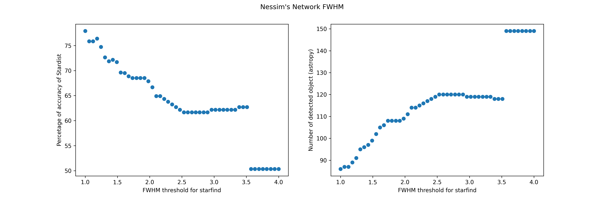

# Thursday 5/04/2022
## Stardist vs Starfind
The goal for this week is to have a pipeline that evaluates the performance of a network compared to starfind algorithm (intensity based detection) and creates a ground truth image based on the spots stardist missed for better retraining. 

Starfind is meant for detecting stars thus it is based on intensity thresholding and segmentation. We saw from previous metrics that the 2 networks tested were able to detect low intensity objects (just above background). We want to know if that is the case for really bright objects. 

The full pipeline can be found in
```shell
jupyter@krakatoa:/home/jupyter/tronador/jupyter-labs/Lab1/Nessim/Updating_stardist_with_astropy.ipynb
```

The idea for the pipeline is to have the analysis done on parts of the image so that the computation is faster and also that the images can be corrected pieces by pieces and fed to the network in small pieces for better training. The first step is thus to crop the big image in smaller images:

We create a list that will contain the images and then crop the big image by moving along the y direction and cutting iterativly along the x axis. It could have been done by defining a matrix of the desired shape and then completing it.

```python 
def crop(image,sizex,sizey):
    
    new_image = []
    for row in range(int(image.shape[1]/sizey)):
        for col in range(int(image.shape[0]/sizex)):
            new_image.append(image[col+(col*(sizex-1)):col+(col*(sizex-1))+sizex-1,row+(row*(sizey-1)):row+(row*(sizey-1))+sizey-1])

    return new_image
```

Find the stars, code adapted from the starfind website. It just enables to play with the different parameters : **fwhm** and **threshold** of intensity
```python
def findstars(p,data,fwhm,thresh):
    
    mean, median, std = sigma_clipped_stats(data, sigma=3)  
    daofind = DAOStarFinder(fwhm=fwhm, threshold=thresh*mean)  
    sources = daofind(data)
    
    if sources is None :
        pos = [np.array([254,254])]
        
    else:
        for col in sources.colnames:  
            sources[col].info.format = '%.8g'  # for consistent table output
        positions = np.transpose((sources['xcentroid'], sources['ycentroid']))
        pos = list(positions)
        apertures = CircularAperture(positions, r=4.)

        if p == 'yes' :

            norm = ImageNormalize(stretch=SqrtStretch())
            plt.imshow(data, cmap='Greys', origin='lower', norm=norm,
                   interpolation='nearest')
            apertures.plot(color='blue', lw=1.5, alpha=0.5)
            plt.show()
    
    return pos
```

Then the goal is to have a function that test wether or not a detected object by astropy is also detected by stardist. To do so we take the centroi coordinates of astropy findings and see on the labeld image is the value at that place is superior to 0.

```python 
def exactmatch(img,pos):
    
    counter = 0 
The goal is n
    for pos in pos:
            
        x = round(pos[0])
        y = round(pos[1])
        
        if x == 255:
            x = 254
        elif y == 255:
            y = 254
            
        #print(x,y)
        if img[y,x] > 0 : # check if at the position found by starfind on the labeled image there is a label
            counter +=1

    return counter
```

Finally we need a function that calls all the other functions and thus makes the analysis automatic for a whole image:

```python
def main(plot,raw_img,lab_img,sizex,sizey,fwhm,thresh):
    
    c = crop(raw_img,sizex,sizey)
    l = crop(lab_img,sizex,sizey)
    
    match = []
    for img,lab in zip(c,l):
        position = findstars(plot,img,fwhm,thresh)
        #print(position)
        match.append(exactmatch(lab,position))
    
    return match
```

Now that we have an automatic pipeline we can perform the analysis for one whole image. What we did after is to study the impact of varying the different parameters of starfind on the accuracy of stardist. This measure of accuracy is calculated by : $$ \frac{objects\,in\, stardist\, and\, starfind}{Total\, number\, of \, detected\,object\, by\,starfind }*100 $$

This gives: 

and 

We can see different things:
- That the general accuracy of starfind for that image is quite good
- That increasing the full width at half maximum (FWHM) decreases the accuracy (by increasing the number of detected objects) 
- By increasing the threshold of intensity the accuracy doesn't decrease but increases to a plateau of about 78%. Meaning the network "missed" around 20% of the brightes spots
- We also see an interesting neat decrease in accuracy when the FWHM reaches 3.5 ?? 

**Notes:**  
- The expected FWHM is around 2-3 pixels as we expect single fluorescent event that are thus diffraction limited and thus around 200nm wide gaussians

- This analysis is only for one image : scan_002_RT17_004_ROI_converted_decon_ch00

- The sigma above background is in realy a mean above background. The sigma for the image considered was really low and thus even with 10 times the sigme we still detected background mostly. Thus we changed the threshold of detection to capture objects thare are n times the intensity of the mean of the patch. Note that this computation is made for all the patches considered not for the global image which increases the precision of the test. 

Outlooks: 
- Find a way to add circles on the labeled image where there is a starfind detected object that is not in stardist

# Friday 06/05/2022 
## Correcting stardist
Now that we have a pipeline for the analysis of the output of a network : either purely quantitatively with the different metric or more in depth using the starfind comparisson (intensity based). The goal now is to have a way to link the analysis with the training of the network to have a complete loop. To do so we need to find a way to add spots on an image at the location where the network "missed" a nuclei. 

Before trying to modify a network we can compare the 2 networks performances on accuracy:


