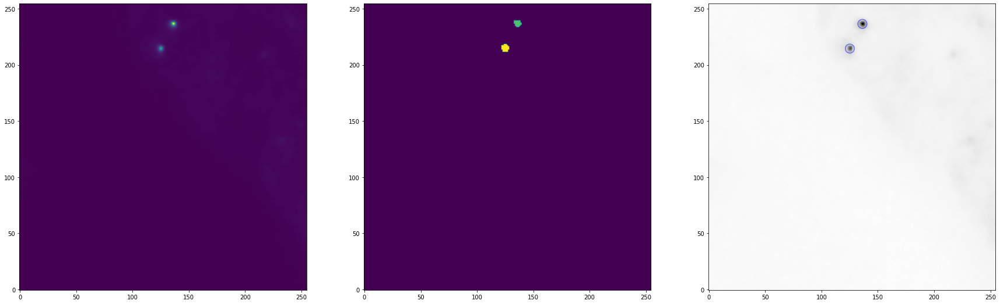
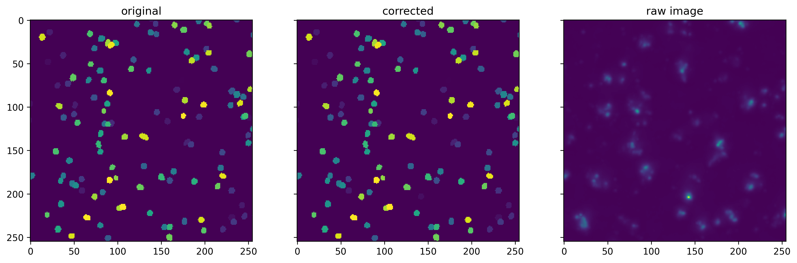

# Monday 09/05/2022
## Correcting stardist 
The goal is to create a function that will call astropy and verify if they are in stardist and correct them if needed. 

The first question is how do you correct them. We are going to add a template sphere on the images. The template sphere we chose is a real object well-detected by the network : 

```python 
def sphere_templ(best_image,object_number,big_lab_img):
    
    m = skimage.measure.regionprops_table(best_image,properties=['slice'])
    sphere = best_image[m['slice'][object_number][0],m['slice'][object_number][1],m['slice'][object_number][2]]
    
    sphere[sphere == np.max(sphere)] = np.max(big_lab_img) + 1 #change the value of the added sphere so that it doesn't interfere with already present label
    
    return sphere

#best sphere so far 

path = '/mnt/tronador/jupyter/jupyter-labs/Lab1/Nessim/Outputs/labeled/scan_002_RT17_004_ROI_converted_decon_ch00_mask.npy'

sphere = sphere_templ(crop_3D_stack(np.load(path),256,256)[60],1,np.load(path))
print(np.shape(sphere))
```


The object is yellow is the selected sphere. 

### Writting the correction function
The correction function works by finding objects in the z projection and adding them to the labeled image from stardist if not already present. This process is in 3 steps:
   - Detecting objects (x,y)
   - At the (x,y) detected find the z plane whith maximum intensity on the raw_image
   - if at that coordinate (x,y,z) the value of the pixel is 0 then add a sphere
 
**Note** : The spere comes from an image where the detection worked. 
  
The correction can work in splitted image and in a big image. However if the image is splitted then the correction must be looped. Moreover, the image doesn't account for near-edge non-detected objects, meaning that it will just skip then.

```python 
def correction(image,lab_img,sphere):
    
    xmax = np.shape(lab_img)[1]
    ymax = np.shape(lab_img)[2]
    zmax = np.shape(lab_img)[0]
    
    #print(xmax,ymax,zmax)

    new_image = lab_img.copy() #create the new_labeled image
    
    positions = findstars('t',np.max(image,axis=0),3,9) # find the objects with astropy in the raw_image z-projected
    
    counter = 0
    counter_correction = 0 
    for pos in positions: #loop for all the object found 
        x = round(list(pos)[1])
        y = round(list(pos)[0])
        z = np.where(image[:,x,y]==max(image[:,x,y]))[0][0] #find in the raw image where the z max is 

        if lab_img[z,x,y] <= 1: #if in the labeled in mage at the z,x,y coordinate there is nothing (i.e <1) 
            if x in [1,2,3,xmax-1,xmax-2,xmax-3] or y in [1,2,3,ymax-1,ymax-2,ymax-3] or z in [0,1,zmax-1,zmax-2,zmax-3]: #to avoid when the objects are too close to the edge solution -> don't replace those objects
                counter = 1 
            else:
                new_image[z-2:z+3,x-4:x+3,y-4:y+3] = sphere #replace with a sphere
                counter_correction +=1
    #print('The number of corrections are '+ str(counter_correction))
                
    return new_image,counter_correction
```

The output of that is :


If you look closely at position (150,200) there is a bright spot on the raw image that is not in the original and that was added on the correction

The image corrected is in : *'Outputs/raw/data_christophe/training/scan_002_RT34_001_ROI_converted_decon_ch00_raw.npy'*

Evaluating the network "theoretical" imporvement by recalculating the accuracy decribed in [Week5](Week5.md) :
```python 
FWHM = 3
threshold = 9 

before = (main_full('ye',np.max(raw,axis=0),np.max(lab,axis=0),256,256,FWHM,threshold)/len(findstars('e',np.max(raw,axis=0),FWHM,threshold)))*100
after = (main_full('ye',np.max(raw,axis=0),np.max(correction(raw,lab,sphere),axis=0),256,256,FWHM,threshold)/len(findstars('e',np.max(raw,axis=0),FWHM,9)))*100

print('The accuracy of the network was '+str(round(before,1))+' and is (theoretically) after correction '+str(round(after,1)))

#Outputs 

#The number of corrections are 82
#The accuracy of the network was 73.7 and is (theoretically) after correction 100.0
```

# Friday 10/05/2022
Creation of the training dataset :

First step is verify that the images are "worth" being corrected :

```python 
def training(path_1,path_2,):
    
    raw= np.load(path_1)

    lab = np.load(path_2)
    
    FWHM = 3
    threshold = 9 

    before = (main_full('ye',np.max(raw,axis=0),np.max(lab,axis=0),256,256,FWHM,threshold)/len(findstars('e',np.max(raw,axis=0),FWHM,threshold)))*100
    after = (main_full('ye',np.max(raw,axis=0),np.max(correction(raw,lab,sphere_1),axis=0),256,256,FWHM,threshold)/len(findstars('e',np.max(raw,axis=0),FWHM,9)))*100

    print('The accuracy of the network was '+str(round(before,1))+' and is (theoretically) after correction '+str(round(after,1)))
    

data_source_r = "Outputs/raw/data_christophe/training"
data_source_l = "Outputs/labeled/data_christophe/training"

file_list_r = [x for x in glob(data_source_r+os.sep+"*.npy") if "00" in x and "ch00" in x]
file_list_l = [x for x in glob(data_source_l+os.sep+"*.npy") if "00" in x and "ch00" in x]


for i,j in zip(file_list_r,file_list_l):
    training(i,j)

```
```
The number of corrections are 82
The accuracy of the network was 73.7 and is (theoretically) after correction 100.0
The number of corrections are 324
The accuracy of the network was 9.8 and is (theoretically) after correction 100.0
The number of corrections are 310
The accuracy of the network was 10.1 and is (theoretically) after correction 100.0
```
```
```

### Perform the correction and save the output 

This is done in multiple steps: 

- The images (full size) are first corrected by calling the function correction and that will yield a labeled image 

- The image is then reshaped by removing one plane over 2 to make the training easier

- The image is then relabeled to ensure that the labels are successive 

- The image is croped in small pieces (here 256 by 256) also the originally labelled image and the raw image are cropped

- We verify croped image per croped image that there was a modification by checking the number of unique number in the original label and the correction. If there is a correction we then store the raw and the corrected croped image

- Finally the image are saved 20% in the testing set and 80% in the training set 

```python 
raw= np.load('Outputs/raw/scan_002_RT19_004_ROI_converted_decon_ch00_raw.npy')

lab = np.load('Outputs/labeled/scan_002_RT19_004_ROI_converted_decon_ch00_mask.npy')


file_list = [x for x in glob('Outputs/raw/'+os.sep+"*.npy") if "19" in x and "ch00" in x]
#print(file_list)

# Removing one plane each 2 planes

z_binning = 2


def removesZplanes(image3D, z_binning):
    
    Zrange = range(0,image3D.shape[0],z_binning)
    
    output = np.zeros((len(Zrange),image3D.shape[1],image3D.shape[2]))
    for i,index in enumerate(Zrange):
        output[i,:,:] = image3D[index,:,:]

    return output

# apply the correction 

corr_img = correction(raw,lab,sphere)[0]
corr_img = relabel_sequential(corr_img,offset=1)[0]

# remove one plane over 2 
corr_img = removesZplanes(corr_img,z_binning)
raw = removesZplanes(raw,z_binning)
lab = removesZplanes(lab,z_binning)

print(np.shape(corr_img),np.shape(raw),np.shape(lab))


#split the correction, the raw image and the original labeled image 

split_cor = crop_3D_stack(corr_img,256,256)
split = crop_3D_stack(lab,256,256)
split_raw = crop_3D_stack(raw,256,256)

# list that will contain all the usable images
usable_lab = []
usable_raw = []

#check for each splited image whether something was added compared to the original labeled image if so add it to the list of usable images

for i in range(64):
    if len(np.unique(split[i])) != len(np.unique(split_cor[i])):
        usable_lab.append(split_cor[i])
        usable_raw.append(split_raw[i])

        
#Saving 

for j in range(len(usable_lab)):
    random = np.random.uniform (0,1,1)[0]
    
    if random < 0.21:
        path = 'training_dataset/testing/'
    else:
        path = 'training_dataset/training/'
        
    imwrite(path+'label/'+str(os.path.basename(file_list[0]).rsplit("_raw.npy")[0])+'_'+str(j+1)+'.tif',usable_lab[j].astype(np.uint16))
    imwrite(path+'raw/'+str(os.path.basename(file_list[0]).rsplit(".npy")[0])+'_'+str(j+1)+'.tif',usable_raw[j].astype(np.uint16))

print(str(len(usable_lab))+' files have been loaded')
```


blue : training 
red : testing 
