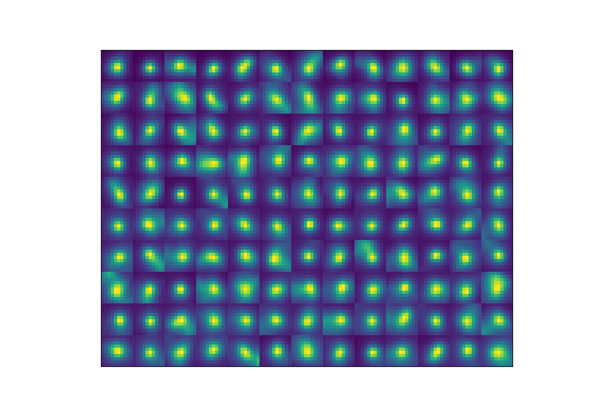

# Analysis of the training(s)

The networks can be found in :
```shell 
/mnt/tronador/jupyter/jupyter-labs/Lab1/Nessim/training/training_*
```

The parameters of the training are the one from jb (the one used to train the simulated image network )

blue : training 
red : testing 


The network learned as the loss per epoch is decreasing. Furthermore, the training stabilized which means that the training is finished. 


Note that the number of false negative and false positive is high compared to the number of true positive which indicates that the training might not be completely accurate

The first training performed was using a combination of simulated images and corrected images. 

Name : "training_test"

Results: 


**Note that more bins were used in the left pannels for the retrained network hence the shape** 

**Note: the image used for this plot comes from data christophe and was never seen by the retrain network**

The first train correspond the the first network we used : ***'PSF_3D_stardist_20210618_simu_deconvolved_thresh_0_01'***

What we see is that the results indicae the objects detected by the network are smaller both in number and in volume. This observation wasn't expected. 


However the segmented object didn't look absurd nor incorrect but we realised that the images used for the training weren't the correct ones. 

We will retrain another network using the same corrected images but adding the correct simulated images that can be found :

```shell
/mnt/tronador/jupyter/training_dataset/rt_simulation_3D/Best_simulations/2021-06-11_10-54/Training_data_thresh_2_Deconvolved
```

This led to :


.svg)
In this training we see that the proportion of false negative and false positive is lower which indicate a better training and more accurate results.

Name of the network : "training V2"

The same parameters have been used for the training (see above). Moreover the weights used to produce the plots were the last weight (from the last epoch) and not the "best" as we saw that it yielded better results.

Wehn analysing an unseen image:


We see that the result looks like the one obtained before. However more objects are detected (half of the first training but still). We still see that the global volume distribution is lower which is still a problem. 

Plotting a gallery: 


Once again the objects look correct. At least the position of the labeled objects are correct, from this plot we have no informations about volume nor number (quantitatively)

After observing the different images we realized that the problem could be from the images corrected that we added. In fact those images already come from one segmentation (from the first network) plus a correction. If the volume of the segmented object there was low the data could be too diverse for the network. 

We verified that hypothesis which revealed to be true after performing the analysis on one image from the testing set. 

This means that in the data used for the training there were labeled object with different volume (2 populations) that "confused the network" which then return globally smaller objects. 

This can  be resolver multiple ways: 
- Change the ratio simulated image/corrected image in the training/testing set
- Remove completely the simulated images and add more corrected images
- Change the size of the added correction (the sphere size)
- Change the size of the simulated objects

All these hypothesis will not be tested unfortunately :'( 
