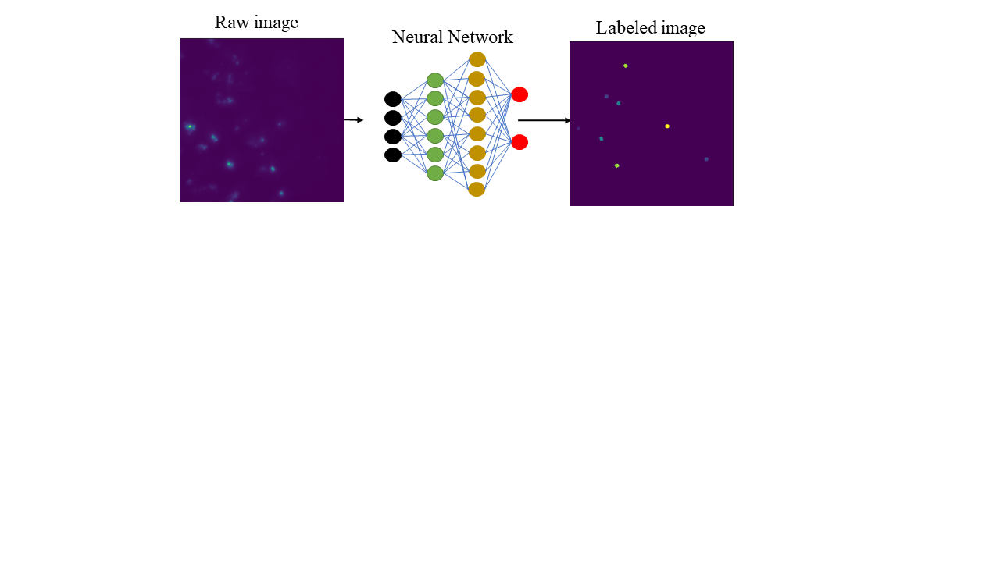

# Figure 1

*Figure 1*: Principle of a neural network

# Figure 2

*Figure 2*: Qualitative assessment of a network performance.
Coordinates of segmented objects reported on the raw image and ranked by increasing maximum intensity from left to right and top to bottom

# Figure 3

*Figure 3:* Quantitative comparison between two network shows clear differences in network performance
Network used : *Simulated* and *image-fed* A.) Intensity histogram of all the segmented objects B.) Volume versus intensity for all the objects segmented for the two networks C.) Intensity versus label ID for the two networks. Every labeled objects is attributed a unique label by the network D.) Intensity profile in the high intensity region for both networks. The high intensity has been set using the camera properties and the maximum pixel value. 

# Figure 4
.svg)
*Figure 4:* Loss versus epoch profile for the retraining of the *simulated* network

# Figure 5 

*Figure 5:* General workflow of the lab 1 
# Figure 6

*Figure 6:* Qualitative assessment of a newly trained network
The network used to produce the image is the retrained network
# Figure 7 

*Figure 7:* Exemple of the correction process 
# Figure 8

*Figure 8:* Quantitative assessment of the retraining process shows no improvement in the object detection
In blue : the retrained network. In orange: the simulated network 
A.) Intensity distribution of all the segmented objects by the networks. B.) Volume versus intensity profile
# Figure 9

*Figure 9:* Training statistics for the retraining
A.) General metrics of training versus the IoU threshold (explain) B.) Evolution of the different metrics of the contengency table versus the IoU threshold. 

